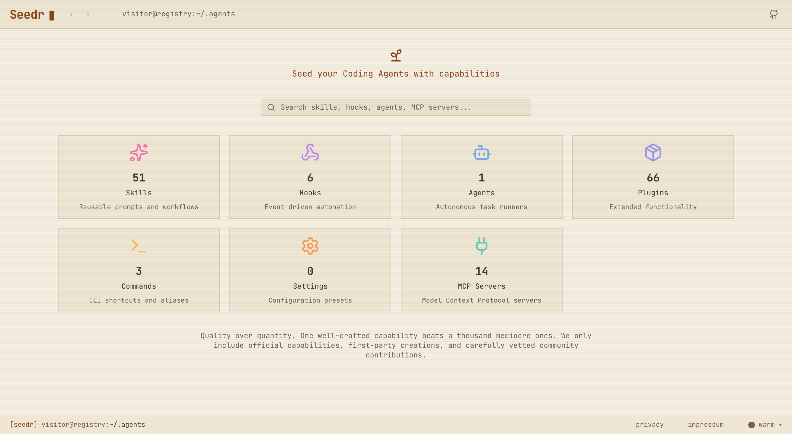
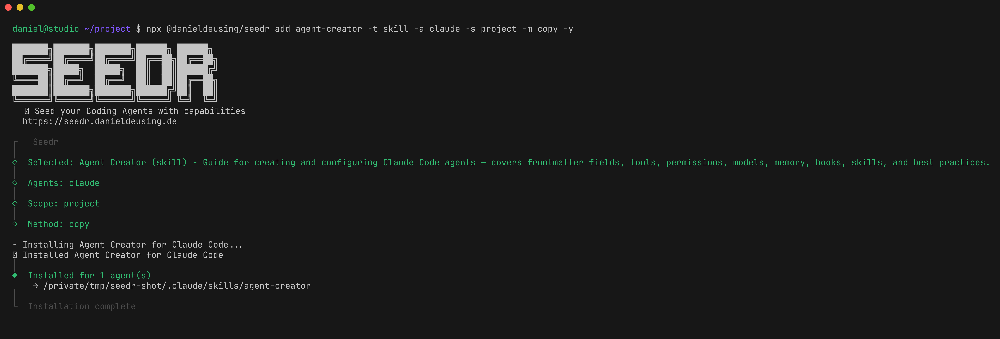

# Seedr

Seed your Coding Agents with capabilities.

Seedr is a CLI tool and web registry for AI coding assistant content. Install curated skills, agents, hooks, plugins, MCP servers, and settings for Claude Code, GitHub Copilot, Gemini, Codex, and OpenCode with a single command.

**Browse the registry** at [seedr.danieldeusing.de](https://seedr.danieldeusing.de) — search, filter by type, and preview items before installing.



**Install from the command line** — one command to add any capability to your project.



## Quick Start

```bash
# Install content interactively
npx @danieldeusing/seedr add

# Install a specific item
npx @danieldeusing/seedr add lint-doctor

# Install for all compatible AI tools
npx @danieldeusing/seedr add design-patterns -a all

# List available content
npx @danieldeusing/seedr list
```

## Content Types

| Type | Description | Compatibility |
|------|-------------|---------------|
| **Skills** | Specialized workflows and domain knowledge | All tools |
| **Agents** | Single-file agent definitions | Claude only |
| **Hooks** | Event-triggered automation | Claude only |
| **Plugins** | Extended functionality packages | Claude only |
| **MCP Servers** | Model Context Protocol integrations | All tools |
| **Settings** | Configuration presets | Claude only |

Browse all content at [seedr.danieldeusing.de](https://seedr.danieldeusing.de)

## CLI Commands

### `add [name]`

Install a skill, agent, hook, plugin, MCP server, or settings preset. Without a name, opens an interactive picker.

```bash
npx @danieldeusing/seedr add                              # Interactive picker
npx @danieldeusing/seedr add lint-doctor                   # Install by name
npx @danieldeusing/seedr add github-mcp -t mcp            # Specify content type
npx @danieldeusing/seedr add design-patterns -a all        # Install for all AI tools
npx @danieldeusing/seedr add pdf -s user                   # Install to user scope
npx @danieldeusing/seedr add code-review --dry-run         # Preview without writing files
```

| Option | Description |
|--------|-------------|
| `-t, --type <type>` | Content type: `skill`, `agent`, `hook`, `plugin`, `mcp`, `settings` |
| `-a, --agents <tools>` | Target AI tools: `claude`, `copilot`, `gemini`, `codex`, `opencode`, or `all` |
| `-s, --scope <scope>` | Installation scope: `project`, `user`, or `local` |
| `-m, --method <method>` | Installation method: `symlink` or `copy` |
| `-y, --yes` | Skip confirmation prompts |
| `-f, --force` | Overwrite existing files |
| `-n, --dry-run` | Preview changes without writing files |

### `list` (alias: `ls`)

List available content from the registry, or show what's installed locally.

```bash
npx @danieldeusing/seedr list                             # List all available content
npx @danieldeusing/seedr list -t plugin                   # Filter by content type
npx @danieldeusing/seedr list -i                          # Show installed items only
npx @danieldeusing/seedr list -i --scope user             # Show user-scoped installations
```

| Option | Description |
|--------|-------------|
| `-t, --type <type>` | Filter by type: `skill`, `agent`, `hook`, `plugin`, `mcp`, `settings` |
| `-i, --installed` | Show only installed items |
| `--scope <scope>` | Scope for installed check: `project` or `user` (default: `project`) |

### `remove <name>` (alias: `rm`)

Remove an installed item. Requires `--type` to identify what to remove. Auto-detects which AI tools have it installed unless `--agents` is specified.

```bash
npx @danieldeusing/seedr remove lint-doctor -t skill       # Remove a skill
npx @danieldeusing/seedr rm pdf -t skill -a claude          # Remove from Claude only
npx @danieldeusing/seedr remove superpowers -t plugin -y    # Skip confirmation
```

| Option | Description |
|--------|-------------|
| `-t, --type <type>` | Content type (required): `skill`, `agent`, `hook`, `plugin`, `mcp`, `settings` |
| `-a, --agents <tools>` | Remove from specific AI tools only (default: auto-detect) |
| `--scope <scope>` | Installation scope: `project`, `user`, or `global` (default: `project`) |
| `-y, --yes` | Skip confirmation prompts |

### `init`

Create AI tool configuration directories in the current project. Useful for setting up a project before installing content.

```bash
npx @danieldeusing/seedr init                             # Initialize for Claude (default)
npx @danieldeusing/seedr init -a all                      # Initialize for all AI tools
npx @danieldeusing/seedr init -a copilot,gemini           # Initialize for specific tools
```

| Option | Description |
|--------|-------------|
| `-a, --agents <tools>` | AI tools to initialize (default: `claude`) |
| `-y, --yes` | Skip confirmation prompts |

## Development

```bash
# Install dependencies
pnpm install

# Build all packages
pnpm build

# Run dev servers (CLI watch + web)
pnpm dev

# Test CLI locally
cd packages/cli && tsx src/cli.ts --help
```

## Testing

```bash
# Run unit tests
pnpm --filter @danieldeusing/seedr test

# Run tests with coverage
pnpm --filter @danieldeusing/seedr test:coverage

# Dry-run an installation (no files written)
cd packages/cli && npx tsx src/cli.ts add code-smell-doctor -a all --scope project --dry-run -y
```

See [docs/manual-tests/dry-run-commands.md](docs/manual-tests/dry-run-commands.md) for comprehensive manual testing commands.

## Self-Hosting

Run your own private seedr instance. See the [Self-Hosting Guide](docs/self-hosting.md) for step-by-step instructions.

## Playgrounds

Interactive HTML playgrounds that visualize seedr's architecture and behavior.

**Live:** [seedr.danieldeusing.de/playgrounds/](https://seedr.danieldeusing.de/playgrounds/)

| Playground | What it shows |
|------------|---------------|
| [CLI Explorer](https://seedr.danieldeusing.de/playgrounds/cli-explorer.html) | Build `npx seedr` commands interactively, see terminal output and file effects |
| [Installation Paths](https://seedr.danieldeusing.de/playgrounds/install-paths.html) | Where files land for every tool/type/scope/method combination |
| [Registry Architecture](https://seedr.danieldeusing.de/playgrounds/registry-architecture.html) | The 3-level split manifest system and data flow |
| [Compatibility Matrix](https://seedr.danieldeusing.de/playgrounds/compatibility-matrix.html) | Which content types work with which AI tools |

