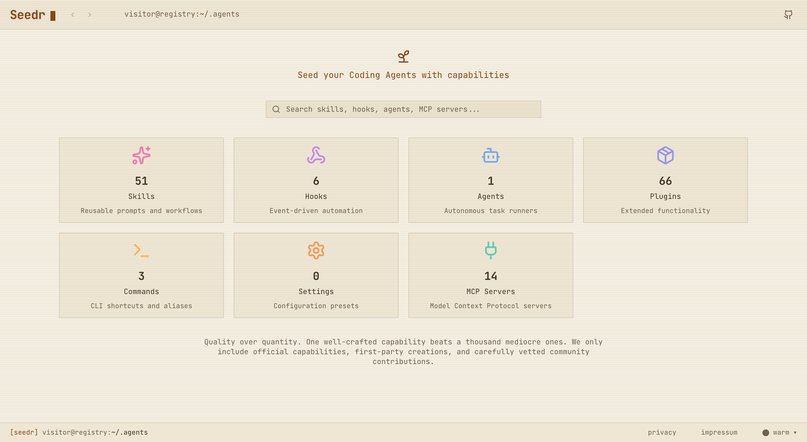
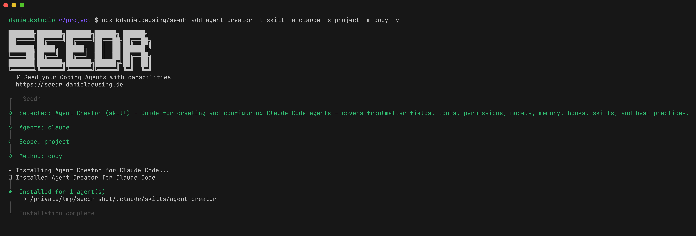

# Seedr

Seed your Coding Agents with capabilities.

Seedr is a CLI tool and web registry for AI coding assistant content. Install curated skills, agents, hooks, plugins, MCP servers, and settings for Claude Code, GitHub Copilot, Google Antigravity, Codex, and OpenCode with a single command.

**Browse the registry** at [seedr.danieldeusing.de](https://seedr.danieldeusing.de) — search, filter by type, and preview items before installing.



**Install from the command line** — one command to add any capability to your project.



## Quick Start

```bash
# Install content interactively
npx @danieldeusing/seedr add

# Install a specific item
npx @danieldeusing/seedr add lint-doctor

# Install for all compatible AI tools
npx @danieldeusing/seedr add design-patterns -a all

# List available content
npx @danieldeusing/seedr list
```

## Content Types

| Type | Description | Compatibility |
|------|-------------|---------------|
| **Skills** | Specialized workflows and domain knowledge | All tools |
| **Agents** | Single-file agent definitions | Claude only |
| **Hooks** | Event-triggered automation | Claude only |
| **Plugins** | Extended functionality packages | Claude only |
| **MCP Servers** | Model Context Protocol integrations | Claude, Codex, OpenCode — each written in that tool's own config format ([details](#mcp-server-targets)) |
| **Settings** | Configuration presets | Claude only |

Browse all content at [seedr.danieldeusing.de](https://seedr.danieldeusing.de)

## CLI Commands

### `add [name]`

Install a skill, agent, hook, plugin, MCP server, or settings preset. Without a name, opens an interactive picker.

```bash
npx @danieldeusing/seedr add                              # Interactive picker
npx @danieldeusing/seedr add lint-doctor                   # Install by name
npx @danieldeusing/seedr add github-mcp -t mcp            # Specify content type
npx @danieldeusing/seedr add design-patterns -a all        # Install for all AI tools
npx @danieldeusing/seedr add pdf -s user                   # Install to user scope
npx @danieldeusing/seedr add code-review --dry-run         # Preview without writing files
```

| Option | Description |
|--------|-------------|
| `-t, --type <type>` | Content type: `skill`, `agent`, `hook`, `plugin`, `mcp`, `settings` |
| `-a, --agents <tools>` | Target AI tools: `claude`, `copilot`, `antigravity`, `codex`, `opencode`, or `all` (`gemini` still works as a deprecated alias of `antigravity`) |
| `-s, --scope <scope>` | Installation scope: `project`, `user`, or `local` |
| `-m, --method <method>` | Installation method: `symlink` or `copy` |
| `-y, --yes` | Skip confirmation prompts |
| `-f, --force` | Overwrite existing files |
| `-n, --dry-run` | Preview changes without writing files |

### `list` (alias: `ls`)

List available content from the registry, or show what's installed locally.

```bash
npx @danieldeusing/seedr list                             # List all available content
npx @danieldeusing/seedr list -t plugin                   # Filter by content type
npx @danieldeusing/seedr list -i                          # Show installed items only
npx @danieldeusing/seedr list -i --scope user             # Show user-scoped installations
```

| Option | Description |
|--------|-------------|
| `-t, --type <type>` | Filter by type: `skill`, `agent`, `hook`, `plugin`, `mcp`, `settings` |
| `-i, --installed` | Show only installed items |
| `-a, --agents <tools>` | Limit the installed check to specific tools (default: all) |
| `--scope <scope>` | Scope for installed check: `project`, `user`, or `local` (default: `project`) |

### `remove <name>` (alias: `rm`)

Remove an installed item. Requires `--type` to identify what to remove. Auto-detects which AI tools have it installed unless `--agents` is specified.

```bash
npx @danieldeusing/seedr remove lint-doctor -t skill       # Remove a skill
npx @danieldeusing/seedr rm pdf -t skill -a claude          # Remove from Claude only
npx @danieldeusing/seedr remove superpowers -t plugin -y    # Skip confirmation
```

| Option | Description |
|--------|-------------|
| `-t, --type <type>` | Content type (required): `skill`, `agent`, `hook`, `plugin`, `mcp`, `settings` |
| `-a, --agents <tools>` | Remove from specific AI tools only (default: auto-detect) |
| `--scope <scope>` | Installation scope: `project`, `user`, or `local` (default: `project`) |
| `-y, --yes` | Skip confirmation prompts |

### Registry location

The CLI reads the registry from this repository's `main` branch on GitHub. A fork or a self-hosted registry points it elsewhere without a code change:

| Variable | Effect |
|----------|--------|
| `SEEDR_REGISTRY_URL` | Base URL the split manifests and item files are served from, e.g. `https://seedr.example.com/registry` |
| `SEEDR_REGISTRY_DIR` | A local `registry/` checkout to read first; the URL is the fallback |
| `SEEDR_NO_TELEMETRY` | Set to anything to skip the anonymous install counter |

### `init`

Create AI tool configuration directories in the current project. Useful for setting up a project before installing content.

```bash
npx @danieldeusing/seedr init                             # Initialize for Claude (default)
npx @danieldeusing/seedr init -a all                      # Initialize for all AI tools
npx @danieldeusing/seedr init -a copilot,antigravity      # Initialize for specific tools
```

| Option | Description |
|--------|-------------|
| `-a, --agents <tools>` | AI tools to initialize (default: `claude`) |
| `-y, --yes` | Skip confirmation prompts |

## MCP Server Targets

`seedr add <server> --type mcp` writes the server definition in the target tool's own
configuration format — never one tool's schema into another tool's file:

| Tool | Project scope | User scope |
|------|---------------|------------|
| Claude Code | `.mcp.json` (`mcpServers`) | `~/.claude.json` (`mcpServers`) |
| OpenAI Codex | `.codex/config.toml` (`[mcp_servers.<name>]`) | `~/.codex/config.toml` |
| OpenCode | `opencode.json` (`mcp`) | `~/.config/opencode/opencode.json` |

GitHub Copilot and Google Antigravity are not MCP targets: their MCP configuration formats
could not be verified against primary documentation, so seedr refuses rather than guessing.

## Registry Integrity

Every item that seedr downloads is pinned to an immutable upstream revision and carries a
SHA-256 digest of its complete file set (see
[`docs/registry-integrity.md`](docs/registry-integrity.md)):

- the CLI fetches all files of an item from **one** upstream commit (`sourceRevision`), never
  from a moving branch, so a multi-file item cannot be assembled from two different commits;
- the downloaded files are hashed and compared with the registry's `contentDigest` **before**
  anything is installed — a mismatch aborts the installation and leaves nothing behind;
- the upstream license text (`LICENSE` / `COPYING` / `NOTICE`) travels with the installed
  content, and the SPDX identifier is recorded on the item where it could be determined;
- plugins record the marketplace `source` they come from (local path, `github`, `url`,
  `git-subdir`) with its pinned SHA, and `strict: false` marketplace entries (such as the
  LSP plugins) are modelled as the marketplace defines them.

## Telemetry

When an installation **succeeds**, the CLI sends one anonymous event **per successful target
tool** to `https://seedr.danieldeusing.de/api/installs` (the install counts shown on the
website). Nothing else is ever sent, and nothing is sent for failed installs or `--dry-run`.

The payload is exactly:

```json
{ "slug": "pdf", "type": "skill", "tool": "claude", "scope": "project", "version": "0.1.87" }
```

The server stores these fields plus the **country** Cloudflare derives from the request and
a timestamp. IP addresses are not stored. Events are deleted after **90 days**. Because no
identifier is stored, the counts are "install events", not unique installs or users — a
client that runs the same command twice counts twice.

Opt out at any time by setting the environment variable before running seedr; when it is set
(to any value) no request is ever constructed:

```bash
SEEDR_NO_TELEMETRY=1 npx @danieldeusing/seedr add pdf
```

Telemetry can never affect an installation: the request is fire-and-forget with a short
timeout, and a failing or unreachable endpoint is ignored.

## Development

```bash
# Install dependencies
pnpm install

# Install the git hooks and link .agents/ into .claude/ (a global ignore-scripts=true skips prepare)
pnpm bootstrap

# Build all packages
pnpm build

# Run dev servers (CLI watch + web)
pnpm dev

# Test CLI locally
cd packages/cli && tsx src/cli.ts --help
```

## Testing

```bash
# Run unit tests
pnpm --filter @danieldeusing/seedr test

# Run tests with coverage
pnpm --filter @danieldeusing/seedr test:coverage

# Dry-run an installation (no files written)
cd packages/cli && npx tsx src/cli.ts add code-smell-doctor -a all --scope project --dry-run -y
```

See [docs/manual-tests/dry-run-commands.md](docs/manual-tests/dry-run-commands.md) for comprehensive manual testing commands.

## Self-Hosting

Run your own private seedr instance. See the [Self-Hosting Guide](docs/self-hosting.md) for step-by-step instructions.

## Playgrounds

Interactive HTML playgrounds that visualize seedr's architecture and behavior.

**Live:** [seedr.danieldeusing.de/playgrounds/](https://seedr.danieldeusing.de/playgrounds/)

| Playground | What it shows |
|------------|---------------|
| [CLI Explorer](https://seedr.danieldeusing.de/playgrounds/cli-explorer.html) | Build `npx seedr` commands interactively, see terminal output and file effects |
| [Installation Paths](https://seedr.danieldeusing.de/playgrounds/install-paths.html) | Where files land for every tool/type/scope/method combination |
| [Registry Architecture](https://seedr.danieldeusing.de/playgrounds/registry-architecture.html) | The 3-level split manifest system and data flow |
| [Compatibility Matrix](https://seedr.danieldeusing.de/playgrounds/compatibility-matrix.html) | Which content types work with which AI tools |

